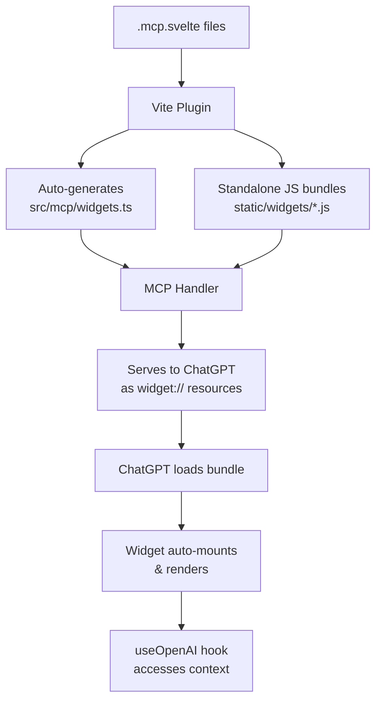

# Chat App Kit

A SvelteKit library for building Model Context Protocol (MCP) servers with reactive Svelte widgets for ChatGPT.

## Overview

This library provides three integrated parts that work together:

1. **Vite Plugin** - Compiles `.mcp.svelte` files into standalone widget bundles
2. **OpenAI Context API** - Svelte runes-based API for widget state and ChatGPT integration
3. **MCP Handler** - Server-side handler for tools, resources, and widget serving

## How It Works



## 1. Vite Plugin

Compiles `.mcp.svelte` files into self-contained JavaScript bundles with inlined CSS.

**What it does:**
- Finds all `.mcp.svelte` files in your project
- Compiles Svelte 5 + Tailwind into standalone IIFE bundles
- Inlines all styles (component CSS + Tailwind utilities)
- Minifies and outputs to `static/widgets/`
- Auto-generates `src/mcp/widgets.ts` with widget definitions that you can customize if necessary

**Setup:**
```ts
// vite.config.ts
import { mcpSveltePlugin } from 'chat-app-kit/vite';

export default defineConfig({
  plugins: [mcpSveltePlugin({ outputDir: 'widgets' })]
});
```

## 2. OpenAI Context API

Reactive Svelte 5 runes API for accessing ChatGPT state inside `.mcp.svelte` components.

**What it provides:**
- `useOpenAI()` - Hook to access ChatGPT context
- Reactive widget state with automatic persistence
- Theme, display mode, locale, safe area
- Methods: `requestDisplayMode()`, `openExternal()`, `callTool()`, `sendFollowUpMessage()`

**Usage:**
```svelte
<script lang="ts">
  import { useOpenAI } from 'chat-app-kit/api';

  const openai = useOpenAI({ widgetState: { count: 0 } });
  
  // Reactive access to ChatGPT state
  $effect(() => console.log(openai.theme)); // 'light' | 'dark'
  
  // State persists automatically
  openai.widgetState.count++;
</script>

<button onclick={() => openai.requestDisplayMode('fullscreen')}>
  Expand
</button>
```

## 3. MCP Handler

SvelteKit server hook that implements the Model Context Protocol to serve widgets, tools, resources, and prompts.

**What it does:**
- Simplifies widget registration as MCP resources (served as `widget://` URIs)
- Let you define tools with Zod/Valibot/Arktype schemas
- Links tools to widgets via `.widget()` method
- Handles all MCP protocol requests (`/mcp` endpoint)

**Setup:**
```ts
// src/hooks.server.ts
import { handleMCP, tool } from 'chat-app-kit/mcp';
import * as widgets from './mcp/widgets'; // Auto-generated
import { z } from 'zod';

export const handle = handleMCP({
  name: 'my-app',
  version: '1.0.0',
  domain: 'https://my-app.example.com',
  
  widgets, // Automatically registers all compiled widgets
  
  tools: {
    greet: tool('Greet a user')
      .input(z.object({ name: z.string() }))
      .widget(widgets.greetingWidget) // Links tool to widget
      .handle(async ({ input }) => `Hello ${input.name}`)
  },
  
  resources: {},
  prompts: {}
});
```

## How The Parts Connect

1. **Vite Plugin** compiles `Greeting.mcp.svelte` → `widgets/greeting.js`
2. **Vite Plugin** generates `widgets.ts` with `export const greetingWidget = widget('greeting', {...})`
3. **MCP Handler** registers `greetingWidget` as resource at `widget://greeting.js`
4. **Tool** links to widget via `.widget(greetingWidget)` adding metadata
5. **ChatGPT** calls tool → handler returns widget URI → ChatGPT loads bundle
6. **Bundle** runs, calls `useOpenAI()` to access **Context API** → widget renders

## Key Features

- **Standalone bundles** - No runtime dependencies, all CSS inlined
- **Reactive state** - Widget state syncs automatically with ChatGPT
- **Type-safe** - Full TypeScript support with schema validation
- **Hot reload** - Changes to `.mcp.svelte` files reload instantly in dev mode
- **MCP compliant** - Follows Model Context Protocol specification
